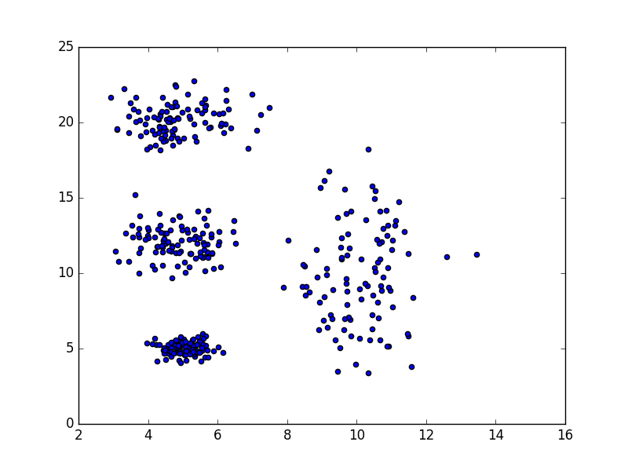
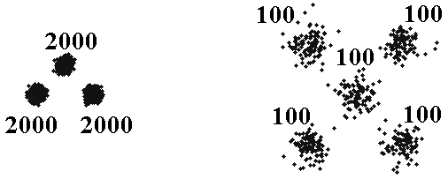

# Домашно №7

Използвайте алгоритъма kMeans  за да се определят автоматично групи от сходни елементи (клъстери) за наборите от данни [normal.txt](datasets/normal.txt) и [unbalance.txt](datasets/unbalance.txt).

| normal | unbalance |
| ------ | --------- |
|  | 

## Вход:

Име на файл и брой клъстери.

## Изход:

Картинка, която показва различните клъстери в ралични цветове. (Всички примери от приложените бази са описани чрез два атрибута – x и у, които са разположението на точката в евклидовото пространство).

* В решението приложете Random Restart с оценка колко са добри постигнатите клъстери. Като оценка можете да ползвате "вътрешно клъстерно разстояние", "междуклъстърно разстояние" и комбинация от двете. Опитайте се да сравните резултатите (можете да сравните и с оценка различна от предложените).
* Като допълнение можете да приложите kMeans++ и да сравните резултатите.
* Като допълнение можете да приложите Soft kMeans и да сравните резултатите.
